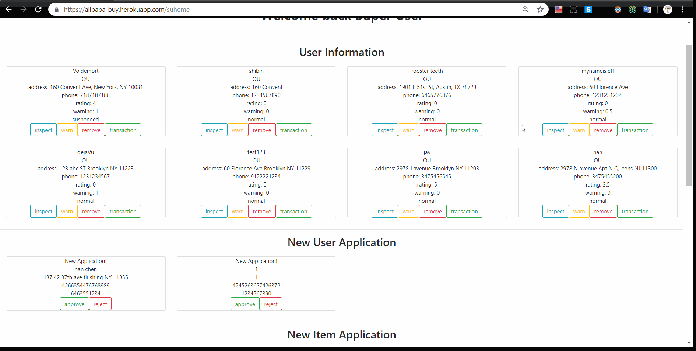

# Alipapa

[Alipapa](https://alipapa-buy.herokuapp.com/) is an online shopping site that allow users to sell and bid/buy almost anything.

## Demo





#### Here's how Alipapa works:

1. A seller lists an item on Alipapa, almost anything from antiques to cars, books to sporting goods. The seller chooses to accept only bids for the item (an auction-style listing) or to offer the Buy It Now option, which allows buyers to purchase the item right away at a fixed price.

2. In an online auction, the bidding opens at a price the seller specifies and remains on Aplipapa for a certain number of days. Buyers then place bids on the item. When the listing ends, the buyer with the highest bid wins.

3. In a Buy It Now listing, the first buyer willing to pay the seller's price gets the item.

## Sample Accounts for Login

- Super User login

  - username: SU
  - password: 123

- Ordinary User login

  - Voldemort

    - username: Voldemort
    - password: 123

  - nan

    - username: nan
    - password: 123

  - jay
    - username: jay
    - password: 123

## Built With

+ [Axios](https://github.com/axios/axios) - Promise based HTTP client
+ [Boostrap](https://getbootstrap.com/) - Front-end framework
+ [Express](https://expressjs.com/) - Server side framework
+ [Firebase](https://firebase.google.com/) - Realtime database
+ [Material-UI](https://material-ui.com/) - React UI framework
+ [React](https://reactjs.org/) - Building user interfaces
+ [Redux](https://redux.js.org/) - Manage application state
+ [Sass](https://sass-lang.com/) - Style sheet
+ [Webpack](https://webpack.js.org/) - Module bundler

## Getting started

1. Clone repo

2. Download [Node.js](https://nodejs.org/en/download/)

3. Using npm (pre-installed by Node.js) or [yarn](https://yarnpkg.com/en/docs/install) to install all dependencies

```
$ npm install
```

```
$ yarn run install
```

4. Setup .env file

- add .env file at root of project folder

5. Run command to start development build and server

```
$ npm run deve
```

```
$ yarn run deve
```

6. Wait until webpack finish development build 

7. Head to _localhost:3000_ in browser

---

## Report and Documents

Visit [our Wiki Page](https://github.com/JiejayLan/CSC322_group_project/wiki/Documents).


